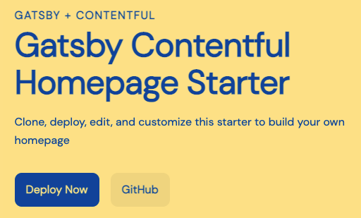
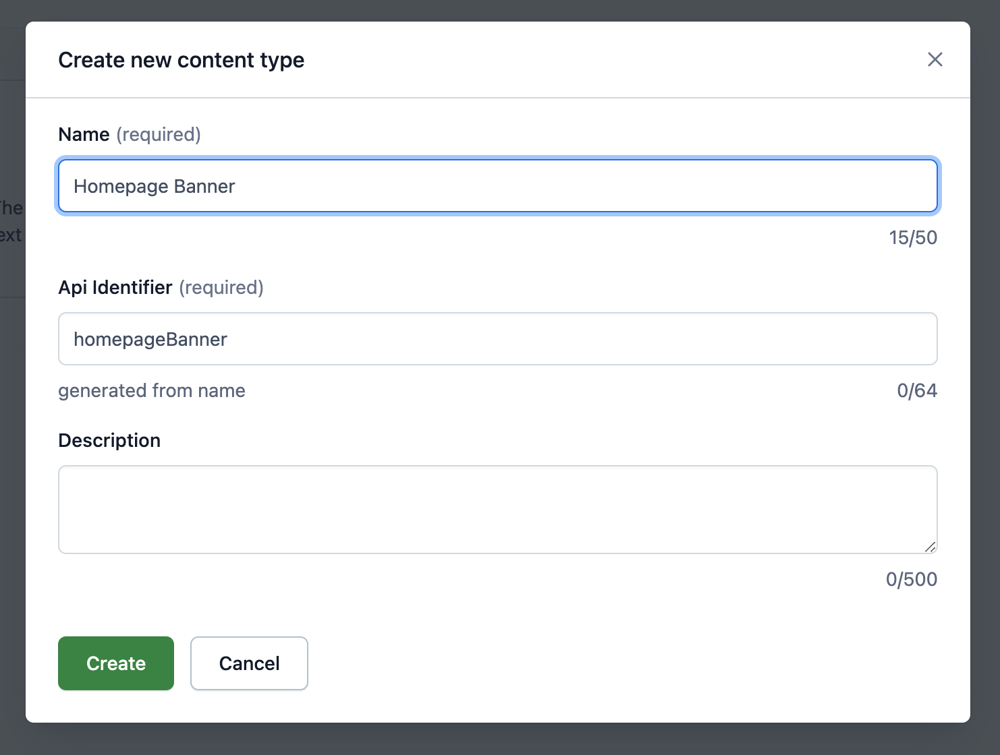
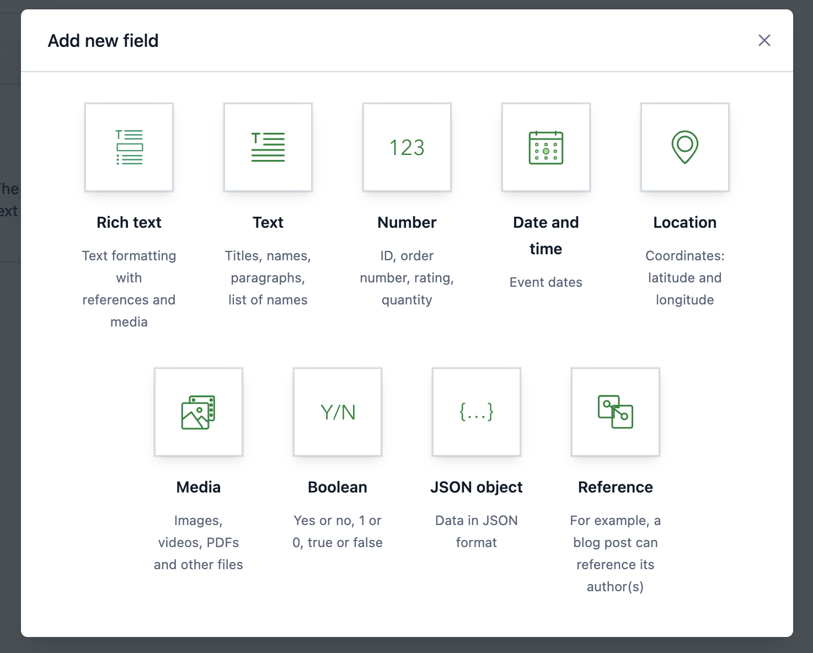
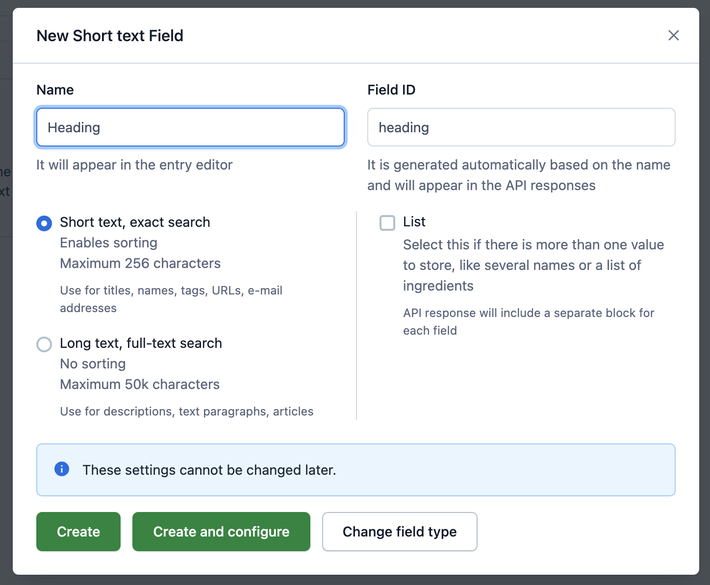
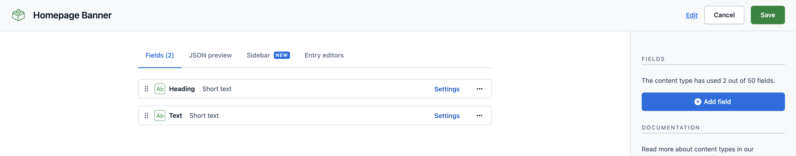
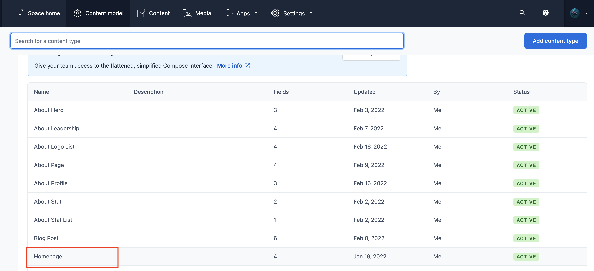
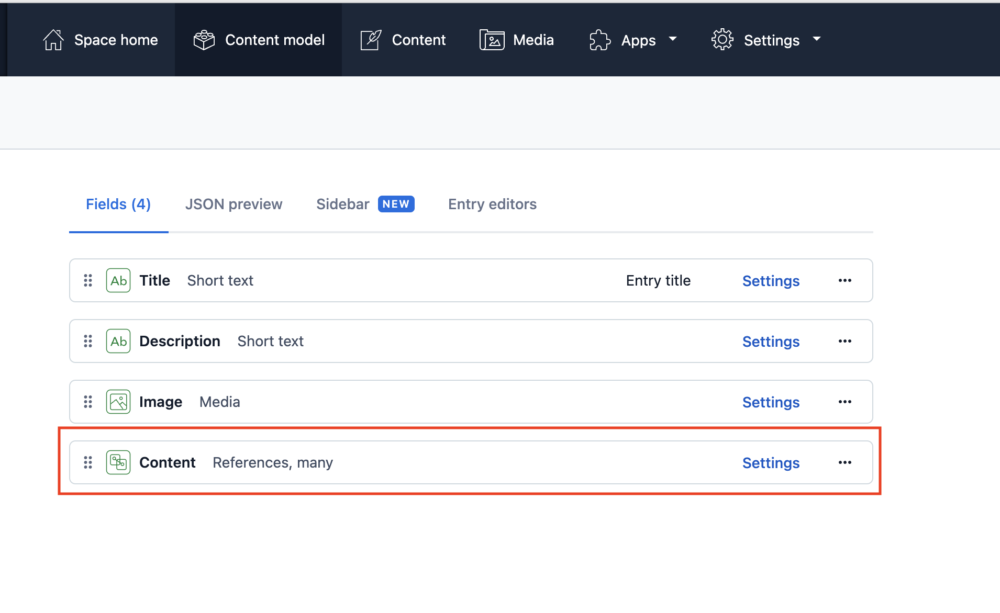
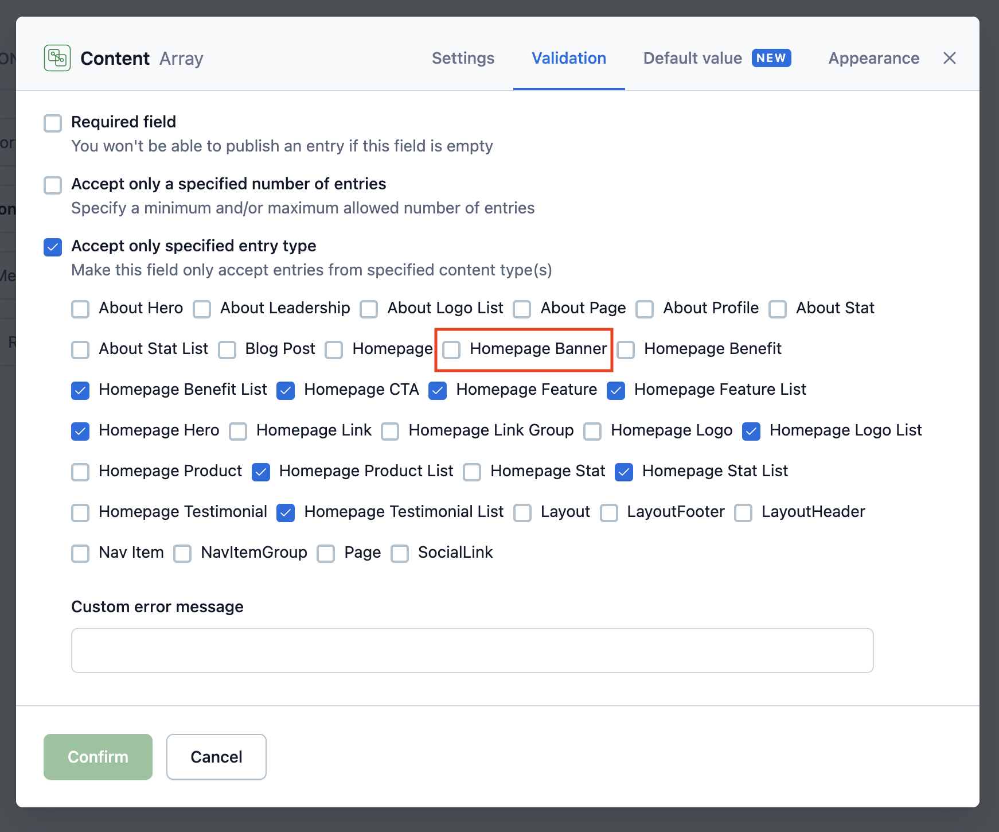
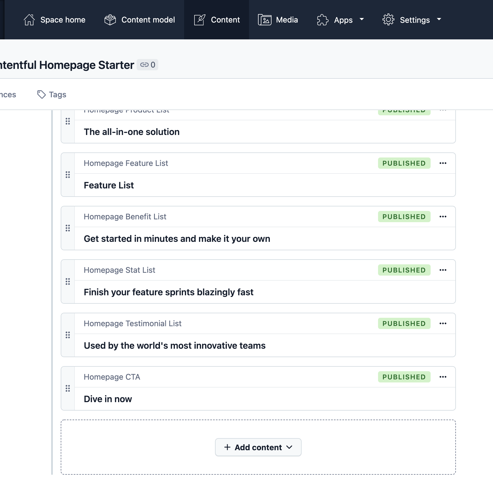
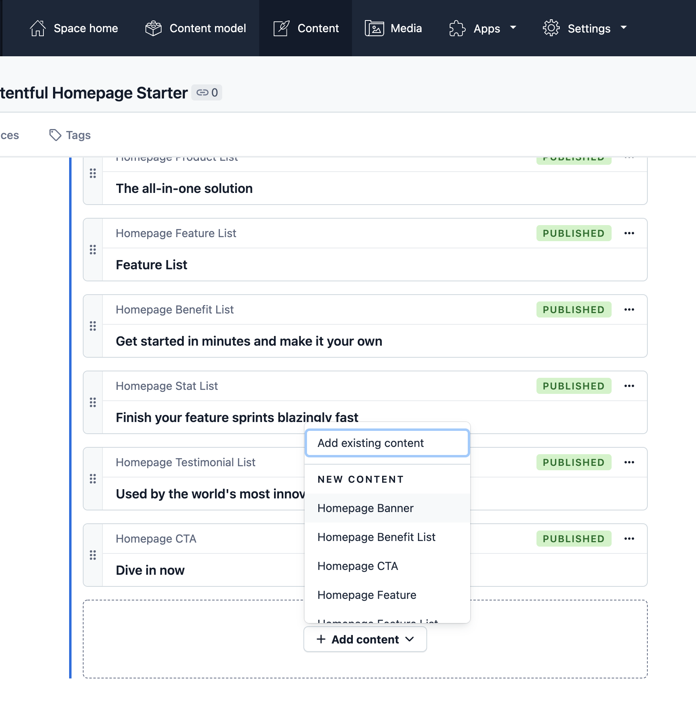

<a href="https://www.gatsbyjs.com">
  
</a>

# Gatsby Starter Contentful Homepage

Create a homepage using Gatsby and Contentful. This starter demonstrates how to use Contentful to build a homepage and can be customized to match your own visual branding.

[View the Demo](https://gatsbycontentfulhomepage.gatsbyjs.io/)

**Note:**
This version of the Contentful homepage starter is written in JavaScript. If you want to use Contentful but TypeScript is more your style, there is also a TypeScript version maintained on [GitHub](https://github.com/gatsbyjs/gatsby-starter-contentful-homepage-ts).

## Quick start

You will need a new or existing [Contentful space][] to use this starter and will be asked for your [Space ID][], [Content Management API Key][] (also referred to as a Personal Access Token) and [Content Delivery API Key][] during installation.

[contentful space]: https://www.contentful.com/help/contentful-101/#step-2-create-a-space
[space id]: https://www.contentful.com/help/find-space-id/
[content delivery api key]: https://www.contentful.com/developers/docs/references/authentication/#api-keys-in-the-contentful-web-app
[content management api key]: https://www.contentful.com/developers/docs/references/authentication/#the-content-management-api

1. **Create a Gatsby site**

   Use the Gatsby CLI to get started locally:

   ```sh repo
   npx gatsby new my-homepage https://github.com/gatsbyjs/gatsby-starter-contentful-homepage
   ```

1. **Run the Contentful setup script**

   From your site's root directory, run:

   ```sh
   cd my-homepage
   yarn setup
   ```

   This will run a script to populate your Contentful space's content model and add demo content.

1. **Start developing**

   In your site directory, start the development server:

   ```sh
   yarn start
   ```

   Your site should now be running at <http://localhost:8000>

1. **Open the source code and start editing**

## Deploy your site

Once your content is available in Contentful, deploy your site to [Gatsby Cloud](https://gatsbyjs.com/products/cloud):

1. Push your local site to a new repo in either GitHub, GitLab, or Bitbucket
1. Log into your [Gatsby Cloud Dashboard][] and click on **Add a site**
1. Use the **Import from a Git repository** option to find your site
1. Add the environment variables from your `.env.production` file to Gatsby Cloud during setup
1. Click **Build site** and your site should start building

For a more detailed walkthrough, see the tutorial on how to [build your site with Gatsby Cloud][tutorial].

[gatsby cloud dashboard]: https://gatsbyjs.com/dashboard
[tutorial]: https://www.gatsbyjs.com/docs/tutorial/part-1/#build-your-site-with-gatsby-cloud

### Deploy without using the CLI

Alternatively, you can deploy this starter directly to Gatsby Cloud.
Note that you will need to set up your content in Contentful manually.

[](https://www.gatsbyjs.com/dashboard/deploynow?url=https://github.com/gatsbyjs/gatsby-starter-contentful-homepage)

## Setting up Gatsby Cloud Preview

To use Gatsby Cloud Preview with this site, see the documentation for
[Installing Content Sync for Contentful][].

[installing content sync for contentful]: https://support.gatsbyjs.com/hc/en-us/articles/4410371995539-Installing-Content-Sync-for-Contentful
[add the gatsby cloud app to contentful]: https://support.gatsbyjs.com/hc/en-us/articles/360056047134-Add-the-Gatsby-Cloud-App-to-Contentful
[connecting to contentful manually]: https://support.gatsbyjs.com/hc/en-us/articles/360052076554-Connecting-to-Contentful-Manually

## What's included?

```sh
├── README.md
├── gatsby-config.js
├── gatsby-node.js
├── src
│   ├── components
│   ├── pages
│   ├── colors.css.ts
│   ├── styles.css.ts
│   └── theme.css.ts
└── .env.EXAMPLE
```

1. **`gatsby-config.js`**: [Gatsby config][] file that includes plugins required for this starter.
1. **`gatsby-node.js`**: [Gatsby Node][] config file that creates an abstract data model for the homepage content.
1. **`src/`**: The source directory for the starter, including pages, components, and [Vanilla Extract][] files for styling.

[gatsby config]: https://www.gatsbyjs.com/docs/reference/config-files/gatsby-config/
[gatsby node]: https://www.gatsbyjs.com/docs/reference/config-files/gatsby-node/
[vanilla extract]: https://vanilla-extract.style/

## How to

### Update the color theme

To update the colors used in this starter, edit the `src/colors.css.ts` file.

```.ts
// src/colors.css.ts
export const colors = {
  background: "#ffd500",
  text: "#005bbb",
  primary: "#005bbb",
  muted: "#f5cc00",
  active: "#004287",
  black: "#000",
}

```

If you'd like to add additional colors, add additional keys to this object.
This file is imported into `src/theme.css.ts` and creates CSS custom properties, that can be imported and used in other `.css.ts` files.

The UI components file `src/components/ui.js` imports styles from `src/components/ui.css.ts`. You can see how the theme and color values are being used in this file.

### Add your logo


Replace the `src/components/brand-logo.js` component with your own brand logo.
If you have an SVG version, it can be rendered inline as a React component, following the example in this file. Note that SVG attributes will need to be camel cased for JSX.

Using an inline SVG for the logo allows it to pick up the colors used in CSS, which is how the logo colors are inverted for the mobile menu.

If you prefer to use an image, use the [`StaticImage`](https://www.gatsbyjs.com/docs/reference/built-in-components/gatsby-plugin-image/#staticimage) component from `gatsby-plugin-image` in place of the SVG in this file.

### Customize headings, buttons, and other styles



To further customize the look and feel of the homepage, edit the UI components in `src/components/ui.js` and styles in `src/components/ui.css.ts`.

### Customize section components

To customize any of the sections of the homepage, edit the relevant component in `src/components`.
Most of the styles for these components are handled with shared UI components in `src/components/ui.js`.

### Create custom section components

To create a new type of section in your homepage, you'll want to create a new section component, using the existing components as an example.
For this example, we'll create a new "Banner" component.

1. First, update your content model in Contentful

   1. In your Contentful space, create a new content type and call it "Homepage Banner."

      

   1. For this example, add two fields to your new content type: `heading` and `text` – these can be _Short text_ types.

      
      
      

   1. Find the content type for _Homepage_ in Contentful and edit the settings for the _Content_ field. Under _Validation_, ensure that the new _Homepage Banner_ type is checked to make it available as a content type on the Homepage.

      
      
      

   1. Navigate to the _Content_ tab to edit the _Homepage_ and add a section with this new _Homepage Banner_ content type.

      
      

1. Update `gatsby-node.js`

   Edit your site's `gatsby-node.js` file, adding an interface for `HomepageBanner` that matches your content model in Contentful.
   This allows the homepage to query the abstract `HomepageBanner` type.

   ```js
   // in gatsby-node.js
   exports.createSchemaCustomization = async ({ actions }) => {
     // ...
     actions.createTypes(`
       interface HomepageBanner implements Node & HomepageBlock {
         id: ID!
         blocktype: String
         heading: String
         text: String
       }
     `)
     // ...
     actions.createTypes(`
       type ContentfulHomepageBanner implements Node & HomepageBanner & HomepageBlock @dontInfer {
         id: ID!
         blocktype: String @blocktype
         heading: String
         text: String
       }
     `)
     // ...
   }
   ```

1. Next, create the Banner component:

   ```jsx fileExt
   // src/components/banner.js
   import * as React from "react"
   import { graphql } from "gatsby"
   import { Section, Container, Heading, Text } from "./ui"

   export default function Banner(props) {
     return (
       <Section>
         <Container>
           <Heading>{props.heading}</Heading>
           <Text>{props.text}</Text>
         </Container>
       </Section>
     )
   }

   export const query = graphql`
     fragment HomepageBannerContent on HomepageBanner {
       id
       heading
       text
     }
   `
   ```

1. Export the component from `src/components/sections.js`

   ```js fileExt
   // src/components/sections.js
   export { default as HomepageHero } from "./hero"
   export { default as HomepageFeature } from "./feature"
   export { default as HomepageFeatureList } from "./feature-list"
   export { default as HomepageLogoList } from "./logo-list"
   export { default as HomepageBenefitList } from "./benefit-list"
   export { default as HomepageTestimonialList } from "./testimonial-list"
   export { default as HomepageStatList } from "./stat-list"
   export { default as HomepageCta } from "./cta"
   export { default as HomepageProductList } from "./product-list"

   // add export for new component
   export { default as HomepageBanner } from "./banner"
   ```

1. Add the GraphQL query fragment to the query in `src/pages/index.js`

   ```js fileExt
   // in src/pages/index.js
   export const query = graphql`
     {
       homepage {
         id
         title
         description
         image {
           id
           url
         }
         blocks: content {
           id
           blocktype
           ...HomepageHeroContent
           ...HomepageFeatureContent
           ...HomepageFeatureListContent
           ...HomepageCtaContent
           ...HomepageLogoListContent
           ...HomepageTestimonialListContent
           ...HomepageBenefitListContent
           ...HomepageStatListContent
           ...HomepageProductListContent
           # New component fragment
           ...HomepageBannerContent
         }
       }
     }
   `
   ```

## Troubleshooting

### Errors after making changes to the schema

If you've made changes to the `gatsby-node.js` file or changes to the Contentful data model, clear the Gatsby cache before running the develop server:

```sh
yarn clean && yarn start
```

---

## 🎓 Learning Gatsby

Looking for more guidance? Full documentation for Gatsby lives [on the website](https://www.gatsbyjs.com/). Here are some places to start:

- **For most developers, we recommend starting with our [in-depth tutorial for creating a site with Gatsby](https://www.gatsbyjs.com/tutorial/).** It starts with zero assumptions about your level of ability and walks through every step of the process.
- **To dive straight into code samples, head [to our documentation](https://www.gatsbyjs.com/docs/).**

## 💫 Deploy

[Build, Deploy, and Host On The Only Cloud Built For Gatsby](https://www.gatsbyjs.com/cloud/)

Gatsby Cloud is an end-to-end cloud platform specifically built for the Gatsby framework that combines a modern developer experience with an optimized, global edge network.
